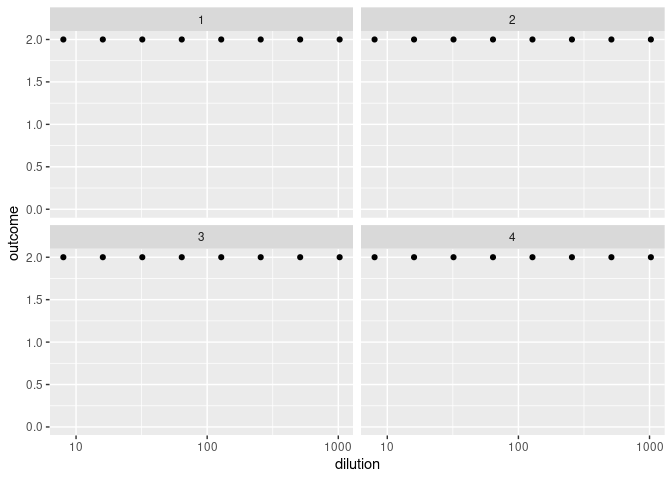

<!-- README.md is generated from README.Rmd. Please edit that file -->

# bayesianTiterCalc

<!-- badges: start -->
<!-- badges: end -->

bayesianTiterCalc is a Bayesian inference method that calculates a serum
sample’s antibody concentration and titer based on data from a standard
neutralization assay. The method uses a logistic function in a
statistical model to simulate mortality in cell culture as a function of
antibody concentration. Given the limited information per sample that’s
inherent in the experimental design of neutralization assays (number of
replicates per dilution and number of dilutions), the advantage of
Bayesian inference here is the use of probability distributions to
incorporate uncertainty in the outcome.

## Installation

You can install the development version of bayesianTiterCalc from
[GitHub](https://github.com/) with:

``` r
# install.packages("devtools")
devtools::install_github("ekamau/bayesianTiterCalc")
```

## Usage

What to do with the package The most common output of a serum
neutralization assay is the calculation of endpoint antibody titer. For
this, (1) How to calculate endpoint antibody titer and concentration (2)
How to simulate data (3) what other output do we need?

Example of data simulation: 30 serum samples with two replicates per
dilution point.

``` r
library(bayesianTiterCalc)
phi_Vals <- c(); ndraws = 30; a = 8.5; b = 2.5; 
prior_phi <- list(n=0.75, m=16)
dilutions <- 2^c(3, 4, 5, 6, 7, 8, 9, 10)

simData <- sample_dose_response(ndraws, prior_phi, a, b, dilutions, 
                                nreplicates_per_dilution=2, phi_Vals)
head(simData)
#> # A tibble: 6 × 4
#>   dilution number_surviving number_replicates  draw
#>      <dbl>            <int>             <dbl> <int>
#> 1        8                2                 2     1
#> 2       16                2                 2     1
#> 3       32                2                 2     1
#> 4       64                2                 2     1
#> 5      128                2                 2     1
#> 6      256                2                 2     1
table(simData$number_surviving)
#> 
#>   2 
#> 240
```

The function *sample_dose_response* samples from a uniform distribution

and calls the *simulate_dose_respose* function.

Plot four simulated samples to see how they look like and if they
resemble the actual data:

``` r
simData.plot(simData, 4)
```



non_monotone \<- dose_responses %\>% group_by(draw) %\>%
summarise(is_non_monotone=non_monotonic(number_surviving))

table(non_monotone$is_non_monotone)

options(repr.plot.width=15, repr.plot.height=8)

What is special about using `README.Rmd` instead of just `README.md`?
You can include R chunks like so:

``` r
summary(cars)
#>      speed           dist       
#>  Min.   : 4.0   Min.   :  2.00  
#>  1st Qu.:12.0   1st Qu.: 26.00  
#>  Median :15.0   Median : 36.00  
#>  Mean   :15.4   Mean   : 42.98  
#>  3rd Qu.:19.0   3rd Qu.: 56.00  
#>  Max.   :25.0   Max.   :120.00
```

You’ll still need to render `README.Rmd` regularly, to keep `README.md`
up-to-date. `devtools::build_readme()` is handy for this. You could also
use GitHub Actions to re-render `README.Rmd` every time you push. An
example workflow can be found here:
<https://github.com/r-lib/actions/tree/v1/examples>.

You can also embed plots, for example:


In that case, don’t forget to commit and push the resulting figure
files, so they display on GitHub and CRAN.
