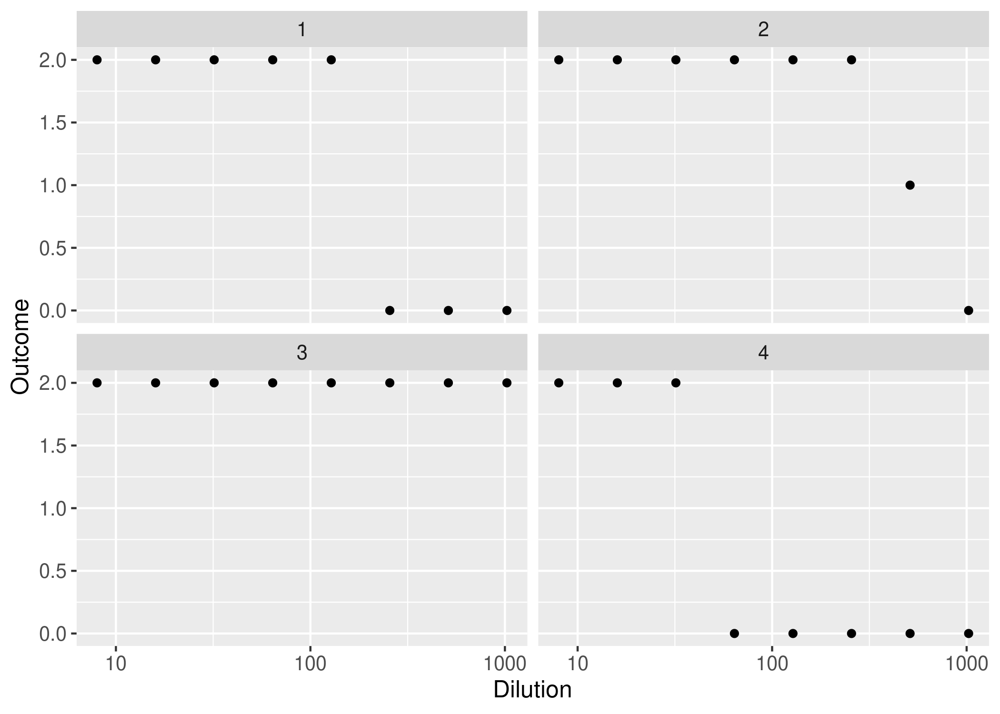
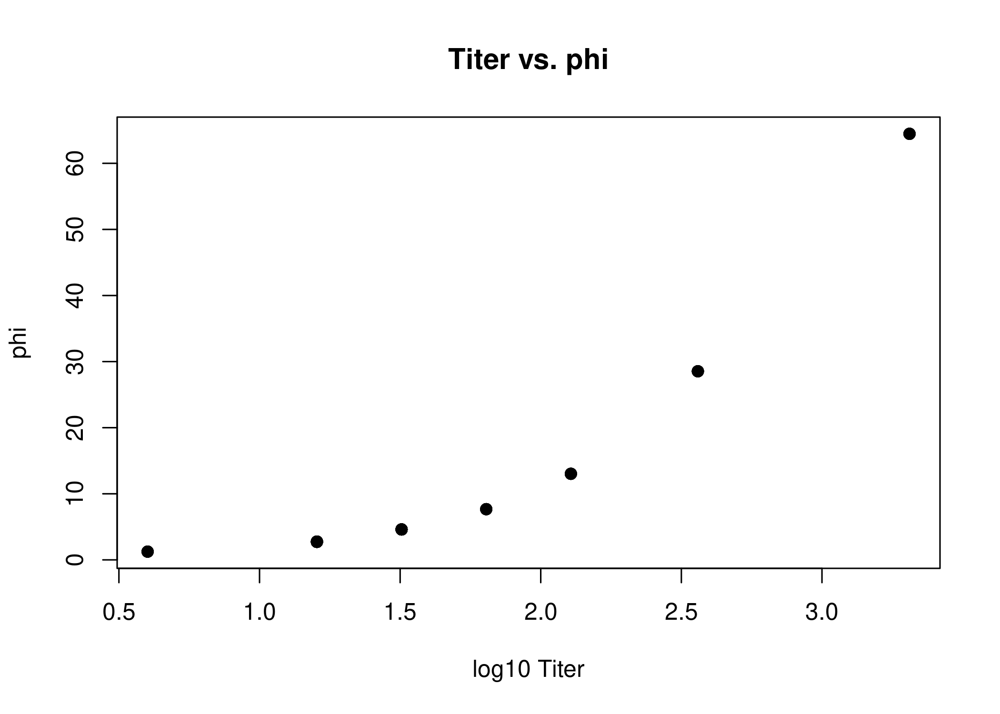
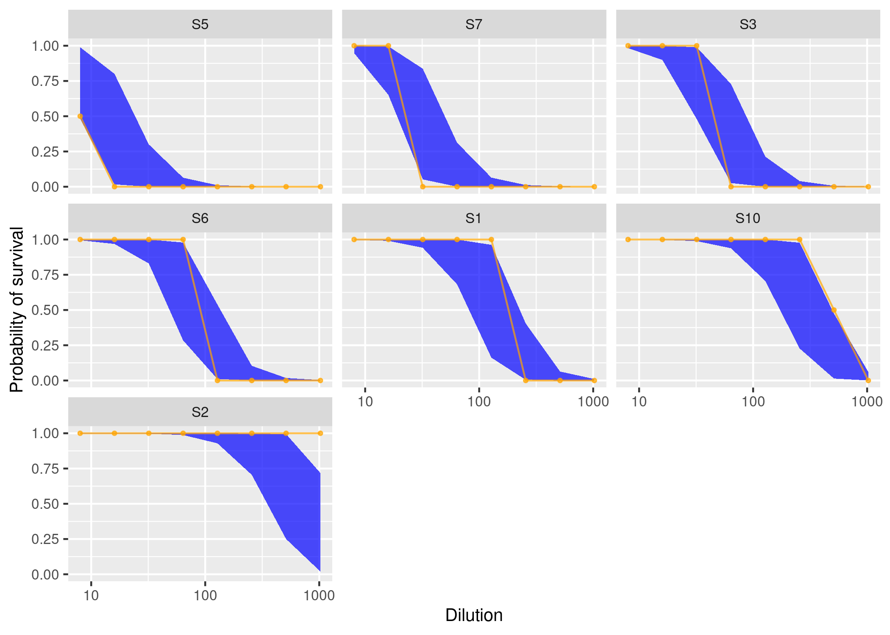
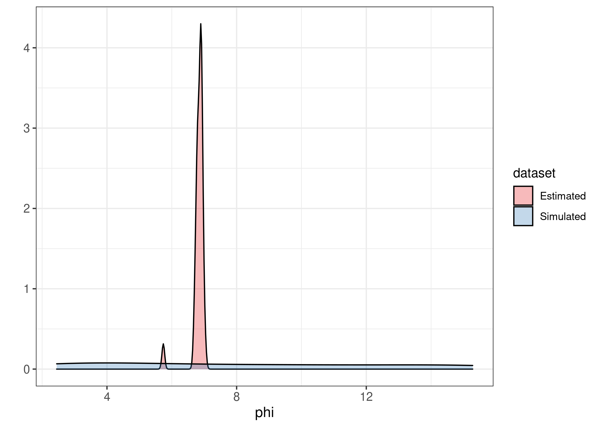

<style>
body {
text-align: justify}
</style>
<!-- README.md is generated from README.Rmd. Please edit that file -->

# bayesianTiterCalc

<!-- badges: start -->

[](https://github.com/ekamau/bayesianTiterCalc/actions)
[](https://codecov.io/gh/ekamau/bayesianTiterCalc)

<!-- badges: end -->

bayesianTiterCalc is a Bayesian inference method that calculates a serum
sample’s antibody concentration, $\phi$, and titer based on data from a
standard neutralization assay. The method uses a logistic function in a
statistical model to simulate mortality in cell culture as a function of
<<<<<<< HEAD
antibody concentration. <br> Given the limited information per sample
that’s inherent in the experimental design of neutralization assays
(number of replicates per dilution and number of dilutions), the
=======
antibody concentration ($\phi$). Given the limited information per
sample that’s inherent in the experimental design of neutralization
assays (number of replicates per dilution and number of dilutions), the
>>>>>>> main
advantage of Bayesian inference here is the use of probability
distributions to incorporate uncertainty in the outcome.

## Installation

You can install the development version of bayesianTiterCalc from
[GitHub](https://github.com/) with:

``` r
# install.packages("devtools")
devtools::install_github("ekamau/bayesianTiterCalc")
```

## Usage

<<<<<<< HEAD
Example of data simulation: 30 samples tested at two replicates per
dilution point and with $\phi$ values sampled from a uniform
distribution between 1.75 and 16.

``` r
library(bayesianTiterCalc)

ndraws = 30; a = 4.5; b = 1.5; prior_phi <- list(lower = 1.75, upper = 16)
dilutions <- 2^c(3, 4, 5, 6, 7, 8, 9, 10); nreplicates_per_dilution = 2
simData <- sample_dose_response(ndraws, prior_phi, a, b, dilutions, nreplicates_per_dilution)
head(simData)
table(simData$number_surviving)
```

Plot four simulated samples to visualize the number of replicates per
dilution with surviving cells:
=======
``` r
library(bayesianTiterCalc)
```

The following example shows the use of the package with serum
neutralization data that is provided in the package. The data was
obtained from 2-fold serum dilutions from 1:8 to 1:1024, where each
dilution was tested in duplicate.
>>>>>>> main

``` r
library(dplyr)

delayedAssign('df', evTitrations)
df <- df %>% mutate(sample=as.numeric(as.factor(sampleID)))
table(df$outcome)
non_monotone <- df %>%
  group_by(sample) %>%
  summarise(is_non_monotone=non_monotonic(outcome))

table(non_monotone$is_non_monotone)
```

Visualize the data to show the number or proportion of replicates that
have surviving cells (Y axis) per dilution:

``` r
library(ggplot2)
options(dplyr.summarise.inform = FALSE)

df %>%
  filter(sample %in% 1:4) %>%
  group_by(sample, dilutions) %>%
  summarise(outcome=mean(outcome) / 2) %>%
  ggplot(aes(x=dilutions, y=outcome)) +
    geom_point() +
    scale_x_log10() +
<<<<<<< HEAD
    ylim(0, 2) +
    labs(x = 'Dilution', y = 'Outcome') +
    theme(axis.title = element_text(size = 12),
          axis.text = element_text(size = 10),
          strip.text = element_text(size = 12)) +
    facet_wrap(~ .data$draw)
```


=======
    theme(axis.title = element_text(size=10),
          axis.text = element_text(size=8),
          strip.text = element_text(size=8)) +
    facet_wrap(~sample)
```


>>>>>>> main

Fit the mechanistic model (a modified logistic function) to the data to
estimate antibody concentration ($\phi$) and the endpoint serum dilution
at 50% cell culture mortality. <br> Here we use the Stan’s *sampling*
algorithm, but the *optimization* algorithm is also available through
the *‘optimizing_stan’* function.

``` r
stan_data <- list(
  N = nrow(df),
  nreplicates=rep(2, nrow(df)),
  survival=df$outcome,
  dilution=df$dilutions,
  nsample=max(df$sample),
  sample=df$sample,
  is_log=1
)

<<<<<<< HEAD
table(non_monotone$is_non_monotone)
#> 
#>  1 
#> 30
=======
fit <- sampling_stan(standata = stan_data, chains=4, iter = 1000, init = 'random')
```

Examine the model estimates - $\phi$ and ED50 - and compare with
antibody titer calculated with the Reed and Muench method.

``` r
phiEstimated <- apply(rstan::extract(fit, "phi")[[1]], 2, mean)
ed50Estimated <- apply(rstan::extract(fit, "ed50")[[1]], 2, mean)
phis_ed50_titers <- df

for(i in 1:nrow(phis_ed50_titers)){
  phis_ed50_titers[i, 'phi'] <- phiEstimated[phis_ed50_titers$sample[i]];
  phis_ed50_titers[i, 'ed50'] <- ed50Estimated[phis_ed50_titers$sample[i]]
}

plot(log10(phis_ed50_titers$titer), phis_ed50_titers$phi, 
     main="Titer vs. phi", ylab="phi", xlab="log10 Titer", pch=19)
plot(log10(phis_ed50_titers$titer), phis_ed50_titers$ed50, 
     main="Titer vs. ED50", ylab="ED50", xlab="log10 Titer", pch=19)
plot(phis_ed50_titers$phi, phis_ed50_titers$ed50, 
     main="phi vs. ED50", ylab="ED50", xlab="phi", pch=19)
>>>>>>> main
```



<br> Extract posterior predictive simulations:

``` r
survival_sim <- rstan::extract(fit, "survival_sim")[[1]]
outcome_sim <- apply(survival_sim, 2, function(x) quantile(x, 0.5))
prob <- apply(rstan::extract(fit, "prob")[[1]], 2, median)
prob_low <- apply(rstan::extract(fit, "prob")[[1]], 2, function(x) quantile(x, 0.025))
prob_high <- apply(rstan::extract(fit, "prob")[[1]], 2, function(x) quantile(x, 0.975))
df <- df %>% 
  mutate(outcome_sim = outcome_sim, prob = prob, prob_low = prob_low, prob_high = prob_high)
df_long <- df %>% 
  select(sampleID, dilutions, outcome, outcome_sim, prob, prob_low, prob_high) %>% 
  rename(actual = outcome, simulated = outcome_sim) %>% 
  mutate(fraction = actual / 2)
```

``` r
bars <- df_long %>% 
  group_by(sampleID) %>% 
  summarise(barcode = paste0(actual, collapse = "")) %>% 
  ungroup() %>% 
  pull(barcode) %>% 
  unique()
bars_lookup <- df_long %>% 
  group_by(sampleID) %>% 
  summarise(barcode = paste0(actual, collapse = ""))
df_long <- df_long %>% left_join(bars_lookup)
df_each_code <- df_long %>% 
  group_by(barcode) %>% 
  summarise(sampleID = first(sampleID)) %>% 
  mutate(keep = TRUE)
df_short <- df_long %>% 
  left_join(df_each_code) %>% 
  filter(keep == TRUE)
```

<br> Plot the probability of cells surviving per serum dilution point:

``` r
library(tidyverse)
tmp <- df_short %>% 
  group_by(sampleID) %>% 
  summarise(first_non_total = which(actual < 2)[1]) %>% 
  mutate(first_non_total = ifelse(is.na(first_non_total), 
                                max(first_non_total, na.rm = T) + 1, 
                                first_non_total))
df_short %>% 
  left_join(tmp) %>% 
  mutate(sampleID = as.factor(sampleID)) %>% 
  mutate(sampleID = fct_reorder(sampleID, first_non_total)) %>%
  ggplot(aes(x = dilutions, y = prob)) +
    geom_ribbon(aes(ymin = prob_low, ymax = prob_high), alpha = 0.7, fill = "blue") +
    geom_point(aes(y = fraction), size = 0.8, alpha = 0.7, colour = "orange") +
    geom_line(aes(y = fraction), alpha = 0.7, colour = "orange") +
    scale_color_brewer("Type", palette = "Dark2") +
    scale_x_log10() +
    labs(y = "Probability of survival", x = "Dilution") +
    theme(axis.title = element_text(size=10),
          axis.text = element_text(size=8),
          strip.text = element_text(size=8)) +
    facet_wrap(~sampleID)
```

<<<<<<< HEAD
Summarize the model fitted data and plot:
=======

>>>>>>> main

``` r
library(ggplot2)

# Compare phi values - in the simulated ('actual') data and those estimated by the model:
phis <- apply(rstan::extract(fit, "phi")[[1]], 2, mean)
phiEstimated <- data.frame('phi' = phis, 'dataset' = rep('Estimated', length(phis)))
head(simData)
phiVals <- (simData[!duplicated(simData[,c('draw')]),'phiValue'])$phiValue
phiSimulated <- data.frame('phi' = phiVals, 'dataset' = rep('Simulated', length(phiVals)))
phiDF <- rbind(phiEstimated, phiSimulated)
head(phiDF)

ggplot(phiDF, aes(phi, fill = dataset)) +
  geom_density(alpha = 0.3) +
  scale_fill_brewer(palette = 'Set1') +
  labs(x = 'phi', y = '') +
  theme_bw() +
  theme(axis.title = element_text(size = 12),
        axis.text = element_text(size = 10))
```


